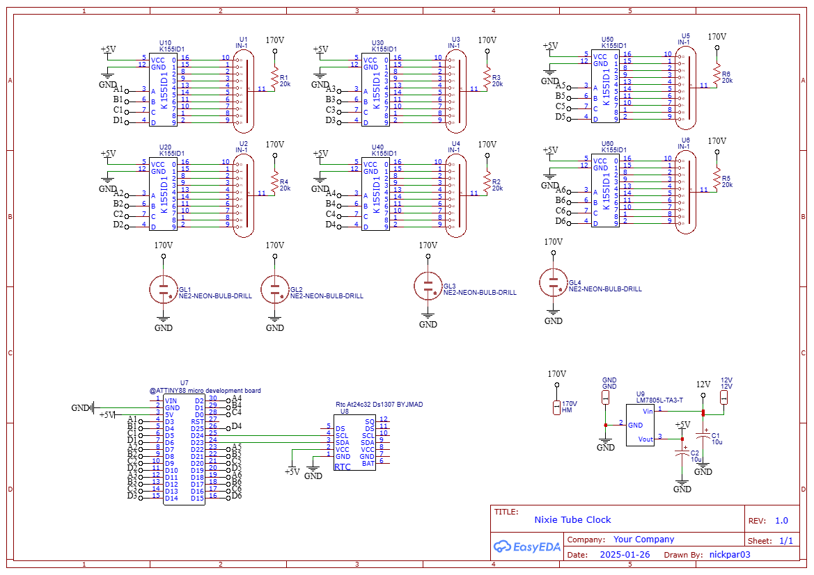
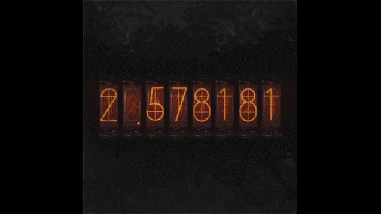

# Nixie-Tube-Clock 

Nixie tubes are a retro way to display numbers perfect for computers in the days before LCD displays. There are many things that can be done with these tubes but I’m doing the thing everyone and their mother has done before: a clock.   

Even though its been done before doesn’t mean it's an easy feat, I bought the IN-1 nixie tube off ebay before researching these clock designs only to realise that these tubes are not recommended for clocks due to their poor construction, so finding a pcb already designed online was not possible for me, so I had to learn how to design pcb’s myself. 

## Design Considerations

When designing this clock I had a few constraints that directly lead to this functional yet flawed final design. I could use shift registers; this would be the smartest option and allow for buttons to control the time but I have no experience using them, or I can use each pin on the microcontroller directly to control the driver IC. There are 24 pins available to use on the ATTINY88, this works perfectly since each driver IC needs 4 pins to control all the values so I can control all 6 tubes. 

I ended up deciding on directly controlling the tubes without shift registers, I decided that the complexity wasn’t worth it for buttons. I may regret this decision at some point, either because the clock drifts or because of daylight savings, either way that problem can be solved by reflashing the board.   

Not shown on the schematic is a power switch used to turn off the high voltage power supply. The power supply has a control pin that when not grounded disables the high voltage output. Meaning I can keep the clock connected to power and shut off the lamps saving battery life.  

### Protecting the tubes
To protect the nixie tubes a current limiting resistor is required. The data sheet says 2.5ma can be used but to make my clock last longer I will use a smaller amount instead:			(170v - 133v) / 1.85ma = 20k ohm   

### schematic

## Flair
I want some flair, I think just having the clock and only the clock would be boring, and burn in the tubes way faster than they should be. So to fix both issues I'll add some flair. I want the tubes to do a quick animation, I want something like in the animation below:   

I think to achieve this effect I’ll simply increase each digit until it wraps around back to where it began or to its new value. I think it would be best if it happened every minute so it’s not distracting but still an interesting effect. My hope is that for the hour some of the numbers are up they will be able to have a second of no power.   
Another feature I want is for the date to be displayed, to achieve this I want it to scroll across the screen like in a bus display. This way each part of the date Year, month and day can scroll past with a space in between making it easier to see.   

## Parts list
1	MH ET LIVE Tiny88 Arduino Board  
1	DS1307 RTC    
6	IN-1 Nixie tube  
6 	K155ID1 Nixie tube driver  
4 	Neon indicator tubes (5mm)  
1 	LM7805 5V voltage regulator  
2	10uf electrolytic capacitor  
6	20kΩ Resistor  
1	12v 🠊 170v boost buck converter   
1	12v power supply  
1	DC Input Jack   

